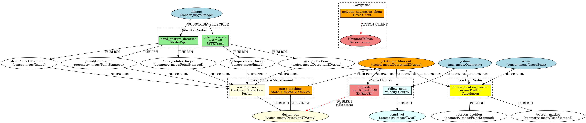
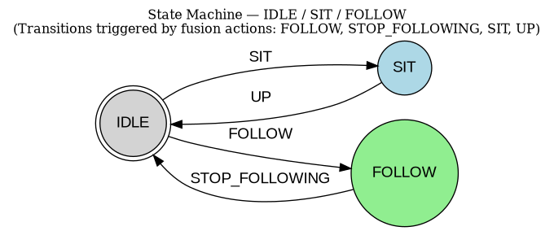

# Dokumentation Go1 Gruppe

## Architektur

## Deployment der Nodes
Alle von uns erstellten nodes laufen auf der Hardware der Workstation.
Die topics /image, /desired_pose und /cmd_vel werden von nodes auf dem GO Roboter mit dem schwarzen Kopf bereitgestellt. Auf das Image topic wird subscribed und die Informationen werden gebraucht um Zeichen und Menschen zu erkennen.
Auf die topics /desired_pose und /cmd_vel werden Daten publiziert. Der Roboter bewegt sich dann in die Sitz bzw. Stehposition und auf dem cmd_vel wird dann die Vorwärtsgeschwindigkeit und die laterale Geschwindigkeit (seitlich) publiziert.

## Statemaschine
Sensor_fusion publiziert auf sensor_fusion_out die folgenden Nachrichten
1. SIT
2. UP
3. FOLLOW
4. STOP_FOLLOWING

Der state_maschine node verarbeitet dann die publizierten Nachrichten und updated dann den state der state_maschine.
state maschine publiziert dann den aktuellen Stand auf /state_maschine_out

## pose_control node

## follower_control

### Was wir bereits (konzeptionell) haben
- Signal (Index Finger) um Following zu starten
- Signal (Daumen) um FOLLOW zu stoppen
- Signal (Voice: UP) um SIT zu beenden
- Signal (Voice: SIT) um in SIT zu gehen

Siehe Architektur hier 
-- > polygon_nav/ros2_architecture.png

Siehe StateMaschine hier
polygon_nav/state_machine.png

### Wiederverwendeter Code
- pose_control

### Was noch fehlt 
- follow_node (Follow Logik)
- follow_node abstimmen mit pose_control: eventuell kurzes timeout, sodass pose_control korrekt aufstehen kann oder weiteres publish topic oder message von pose_control zu follow_node (eine Art GO Signal)