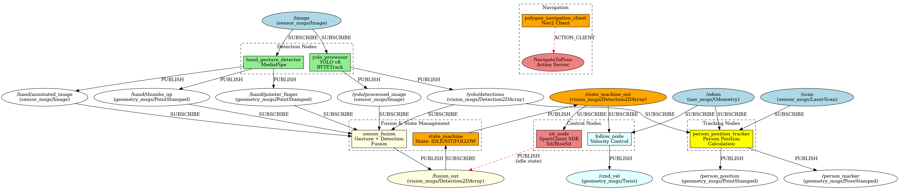
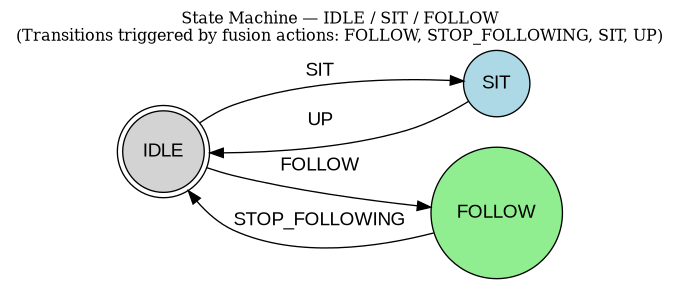

# Dokumentation Go1 Gruppe

## Architektur

## Deployment der Nodes
Alle von uns erstellten nodes laufen auf der Hardware der Workstation.
Die topics /image, /desired_pose und /cmd_vel werden von nodes auf dem GO Roboter mit dem schwarzen Kopf bereitgestellt. Auf das Image topic wird subscribed und die Informationen werden gebraucht um Zeichen und Menschen zu erkennen.
Auf die topics /desired_pose und /cmd_vel werden Daten publiziert. Der Roboter bewegt sich dann in die Sitz bzw. Stehposition und auf dem cmd_vel wird dann die Vorwärtsgeschwindigkeit und die laterale Geschwindigkeit (seitlich) publiziert.

## Dokumentation der Funktionalität der Nodes
### Statemaschine (state_maschine.py)
Sensor_fusion publiziert auf sensor_fusion_out die folgenden Nachrichten
1. SIT
2. UP
3. FOLLOW
4. STOP_FOLLOWING

Der state_maschine node verarbeitet dann die publizierten Nachrichten und updated dann den state der state_maschine.
state maschine publiziert dann den aktuellen Stand auf /state_maschine_out

Hinter diesen wenigen Zeilen steckt eine bewusst einfache, aber robuste Zustandslogik: Die Statemaschine akzeptiert ausschließlich die vier Aktionsstrings, normalisiert sie (Trim + Großschreibung) und prüft sie gegen eine harte Übergangstabelle. Unerlaubte Kombinationen – etwa STOP_FOLLOWING im Zustand SIT – werden verworfen, damit zufälliges Rauschen keine Seiteneffekte erzeugt. Ein interner Merker verhindert doppelte Veröffentlichungen desselben Zustands; nur wenn sich IDLE/SIT/FOLLOW tatsächlich ändert, wird die neue Ausprägung als `std_msgs/String` auf `/state_machine_out` publiziert. 

### pose_control node (pose_control.py)

Der pose_control Node ist die Übersetzungsinstanz zwischen den abstrakten Zuständen der State Machine und konkreten Körperhaltungen des Go1. Sobald auf `/state_machine_out` ein neuer Zustand publiziert wird, setzt pose_control ihn in eine Pose oder Animation um. Für IDLE läuft eine dezente Idle-Schleife, damit der Hund nicht starr wirkt. Beim Übergang in SIT wird eine Interpolationssequenz ausgeführt, die die Gelenkwinkel sanft in die Sitzhaltung fährt. Für FOLLOW (bzw. FOLLOWING) wird wieder in den neutralen Stand überblendet, damit der Motion-Controller eine stabile Ausgangsbasis hat. Alle berechneten Haltungsvorgaben werden als `go1_legged_msgs/DesiredPose` auf `/desired_pose` publiziert. Eine kleine Animations-Engine mit Timer sorgt dafür, dass Sequenzen geloopt oder beendet werden können. Dank dieser Kapselung muss die Statemaschine lediglich Strings verschicken und bleibt unabhängig von der konkreten Bewegungsimplementierung.

### hand_gesture_detector (hand_gesture_detector.py)

Der Hand-Gesten-Node verarbeitet den Kamerastream auf `/image` mit MediaPipe Hands und extrahiert Landmarks beider Hände. Er erkennt in jedem Frame, ob der Zeigefinger aufgerichtet ist, und bestimmt dessen Pixelkoordinaten. Zusätzlich prüft er, ob eine Thumbs-up-Geste vorliegt, bei der der Daumen nach oben zeigt und die anderen Finger eingeklappt sind. Beide Ergebnisse werden als `geometry_msgs/PointStamped` auf `/hand/pointer_finger` und `/hand/thumbs_up` veröffentlicht. Ein annotiertes Bild mit Skelettlinien, Markern und Debugfarben wird auf `/hand/annotated_image` publiziert, was das Debugging erleichtern soll. Umfangreiche Logmeldungen geben Aufschluss über erkannte Gesten und deren Koordinaten. Die gewonnenen Pixelinformationen bilden später die Grundlage, um Gesten einer Person im YOLO-Bild zuzuordnen. Durch die GPU-beschleunigte MediaPipe-Pipeline bleibt die Latenz gering, obwohl mehrere Hände gleichzeitig verfolgt werden können.

### Menscherkennung (yolo_processor.py)

Der yolo_processor Node empfängt den Kamerafeed und führt darauf YOLOv8-Inferenz mit BYTETrack-Tracking aus. Jede erkannte Person erhält eine stabile Tracking-ID, sodass Sensor Fusion später gezielt Gesten einer Person zuordnen kann. Die Bounding-Box-Koordinaten und Scores werden als `vision_msgs/Detection2DArray` auf `/yolo/detections` veröffentlicht. Parallel entsteht ein annotiertes Bild mit Boxen und IDs, das auf `/yolo/processed_image` publiziert wird und beim Debugging hilft.  Durch konfigurierbare Konfidenzschwellen lässt sich die Erkennung zwischen Präzision und Recall abstimmen. BYTETrack sorgt dafür, dass IDs auch bei kurzzeitigen Occlusions erhalten bleiben, was das Follow-Verhalten deutlich ruhiger macht. Optional könnte derselbe Node später weitere Klassen (z.B. Haustiere) freischalten, ohne die restliche Architektur zu ändern.

### Folgemechanismus (follower_control.py)

Follower_control wandelt den vom Sensor Fusion gelieferten Zielpersonen-Stream in konkrete Bewegungsbefehle um. Der Node subscribed auf `/state_machine_out` und aktiviert sich nur, wenn der Zustand FOLLOW aktiv ist. Über `/human_tracker/target_person` erhält er die Pixelposition der Zielperson sowie die Boxhöhe als Distanzmaß. Aus der horizontalen Abweichung zur Bildmitte leitet er eine gewünschte Drehgeschwindigkeit ab, während die Boxhöhe genutzt wird, um näher heranzufahren oder Abstand zu gewinnen. Die Regelung erfolgt bewusst simpel mittels zweier Proportionalglieder (für Winkel und Distanz), deren Ausgaben hart auf definierte Maximalgeschwindigkeiten begrenzt werden. Sobald neue Werte vorliegen, veröffentlicht der Node ein `geometry_msgs/Twist` auf `/cmd_vel`, das direkt vom Unitree-Motion-Stack verarbeitet wird. Parametrische Kp-Werte und Geschwindigkeitsgrenzen erlauben es, das System bei Bedarf an unterschiedliche Kamera-Setups oder Laufgeschwindigkeiten anzupassen. Wird FOLLOW deaktiviert, sendet der Node automatisch eine Nullgeschwindigkeit, sodass der Roboter sofort stoppt.

### Sensor Fusion (sensor_fusion.py)

Der Sensor-Fusion-Node fungiert als Gehirn, das Handgesten, Sprachbefehle und Personendetektionen zu einer einheitlichen Handlungsempfehlung kombiniert. Er subscribed parallel auf `/yolo/detections`, `/hand/pointer_finger`, `/hand/thumbs_up`, `/hand/annotated_image`, `/voice_commands` sowie die YOLO-Bildausgabe, um sowohl geometrische als auch semantische Informationen zu verknüpfen. Hält eine Person länger als drei Sekunden den Zeigefinger auf eine erkannte Person, wird die entsprechende Bounding-Box-ID gespeichert und als verfolgtes Ziel markiert; gleichzeitig entstehen Zielkoordinaten, die auf `/human_tracker/target_person` publiziert werden (nur diejenigen Koordinaten mit der zuerst erkannten ID, nach Zeigefingerzeichen). 

Ein Daumen-hoch-Geste, ebenfalls über mehrere Sekunden gehalten, löst das Kommando STOP_FOLLOWING aus. Sprachbefehle wie „Sitz“ oder „Auf“ werden direkt mit Priorität verarbeitet und setzen das Ergebnis unabhängig von Gesten. Alle ermittelten Aktionen (FOLLOW, STOP_FOLLOWING, SIT, UP) werden als `std_msgs/String` auf `/fusion_out` veröffentlicht, wodurch die Statemaschine einfach zu steuernde Signale bekommt. Zeitstempel, Totzeiten und Puffer verhindern, dass kurzzeitige Gestenflackern falsche Entscheidungen erzwingen. Zusätzlich wird eine Tracking-ID verwaltet, sodass nur die aktuell selektierte Person Befehle auslöst. Dieser Node ist damit der zentrale Vermittler zwischen Wahrnehmung und Verhalten.

### Spracherkennung (vosk_mic_listener)

### Disclaimer
- pose_control und follower_control konnten zum Teil aus einem  
- pose_control
- follower_control